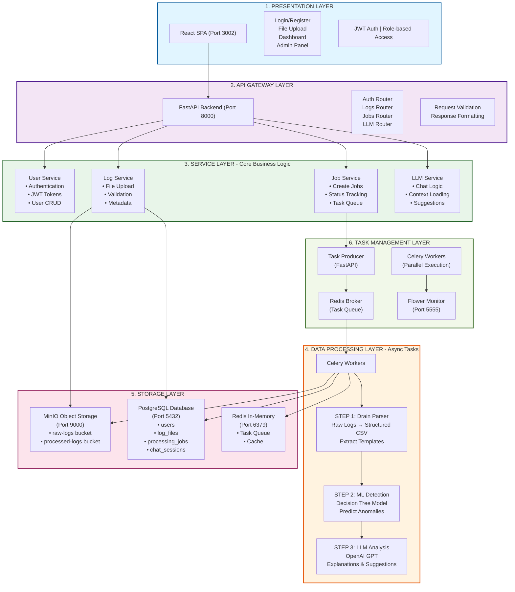
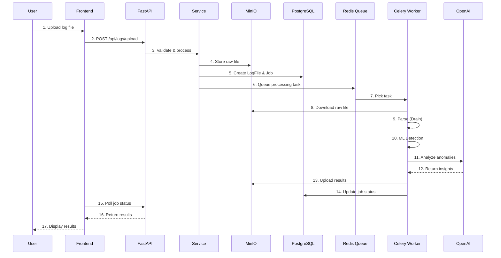
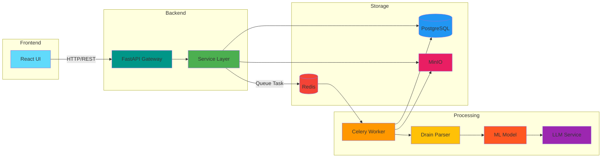
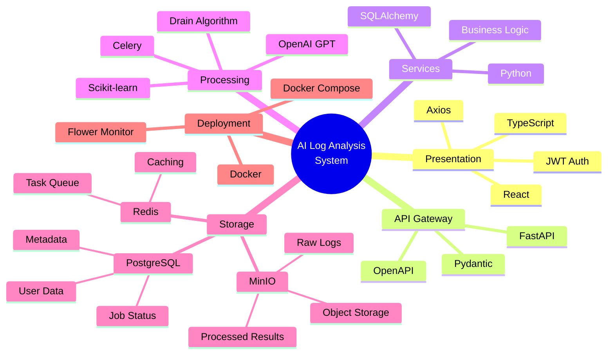

# AI Log Analysis System - Architecture Diagram

## Overall System Architecture (6 Layers)

## Simplified Data Flow

## Component Interaction

## Technology Stack Overview

---

## How to Use These Diagrams

1. **For Markdown Preview**: Use VSCode with Mermaid extension
2. **For Thesis (Images)**:
   - Use [Mermaid Live Editor](https://mermaid.live)
   - Paste the code above
   - Export as PNG/SVG
3. **For LaTeX**: Use `mermaid` package or convert to images

**Created**: 2025-12-16
