# Authentication Flow - Sequence Diagrams (Mermaid)

This document contains Mermaid sequence diagrams for the authentication flow.
You can view these in GitHub, VS Code with Mermaid extension, or online at https://mermaid.live/

---

## 1. User Registration Flow

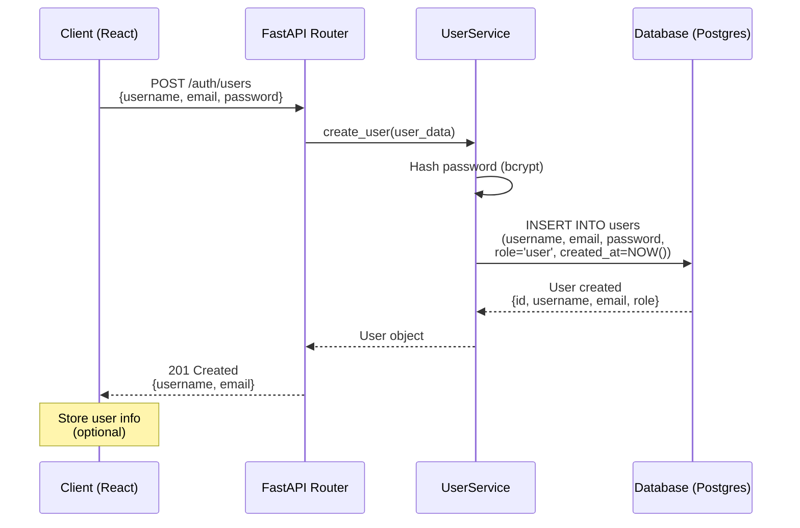

---

## 2. User Login Flow (JWT Token Generation)

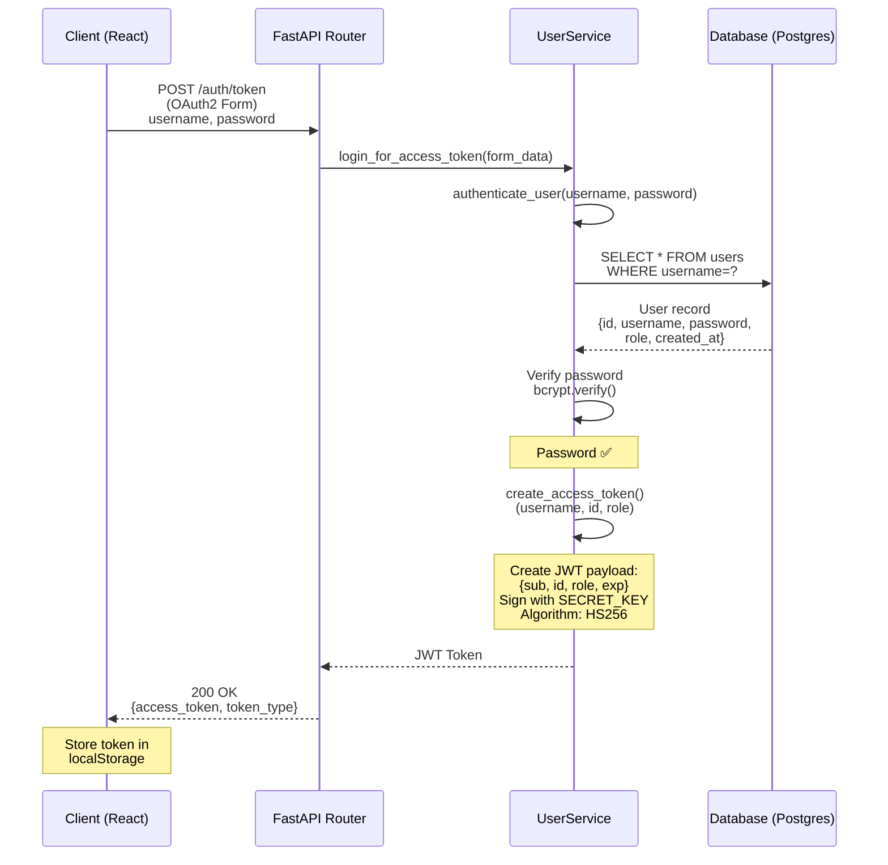

---

## 3. Protected Route Access (Regular User)

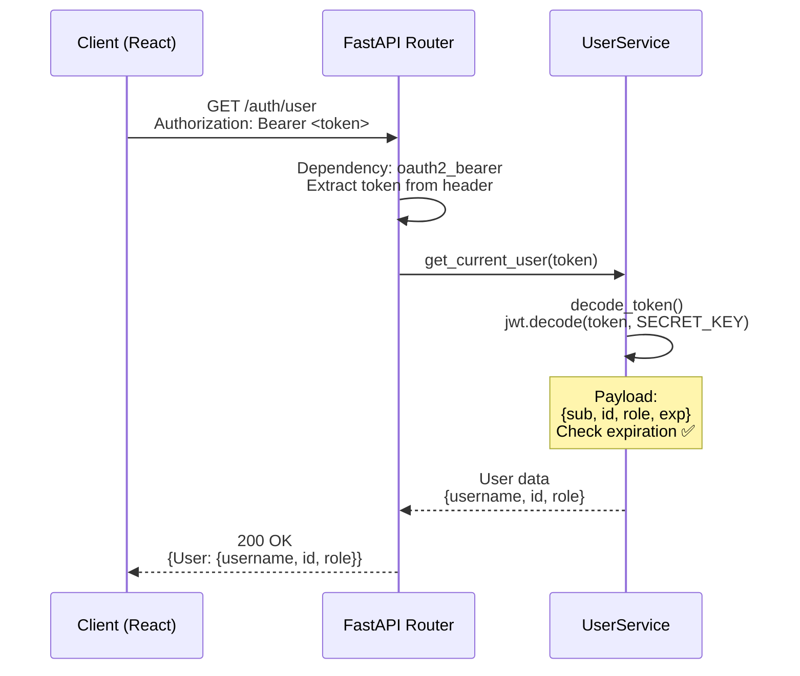

---

## 4. Admin-Only Route Access (Admin User - Success)

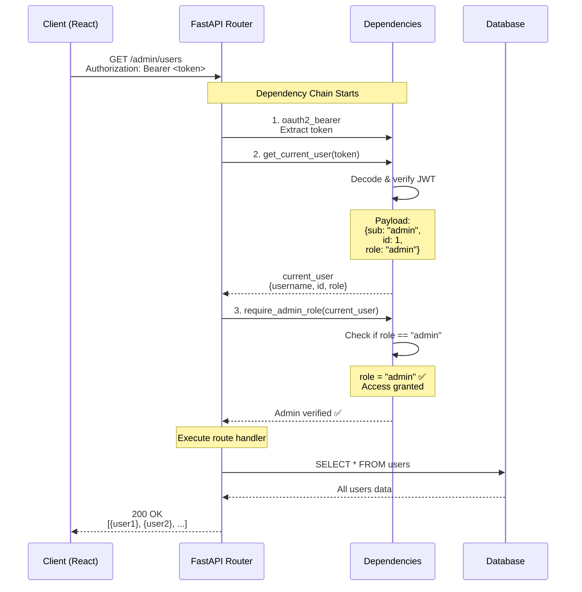

---

## 5. Admin Route Access DENIED (Regular User)

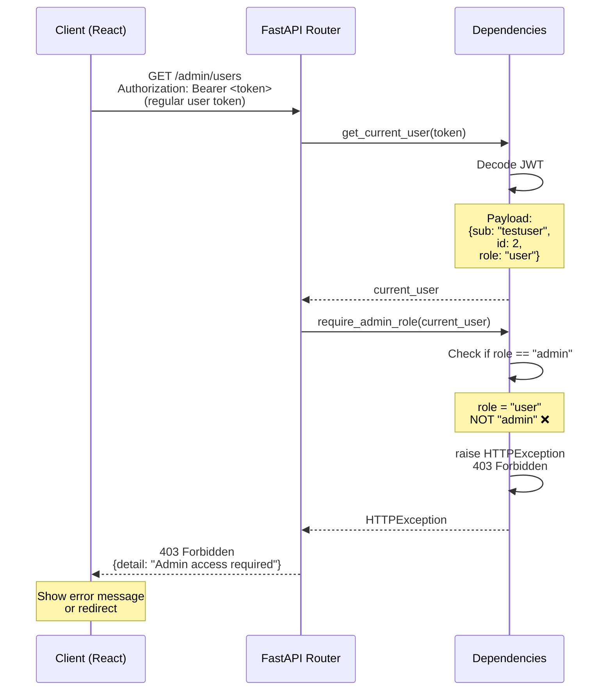

---

## 6. Token Expiration Flow

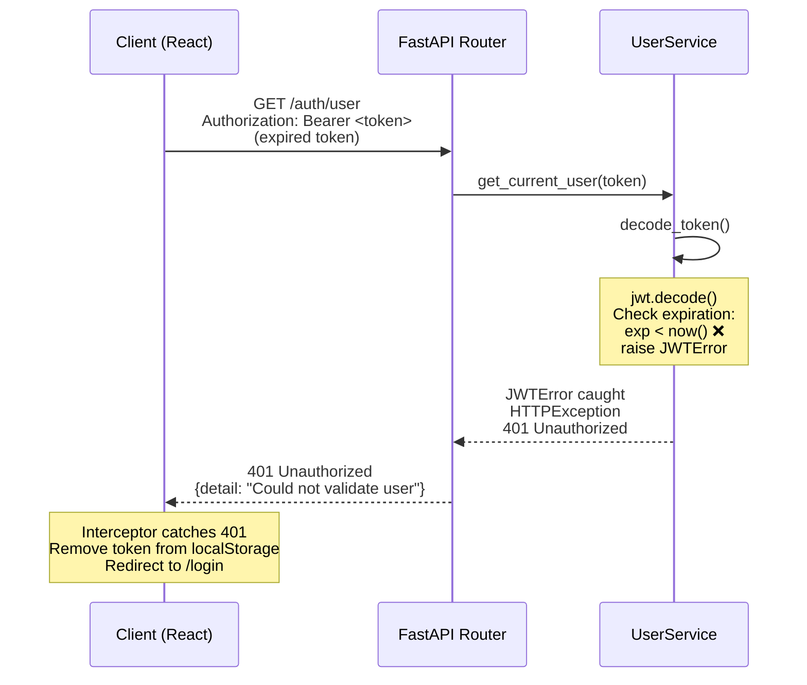

---

## 7. Invalid/Tampered Token Flow

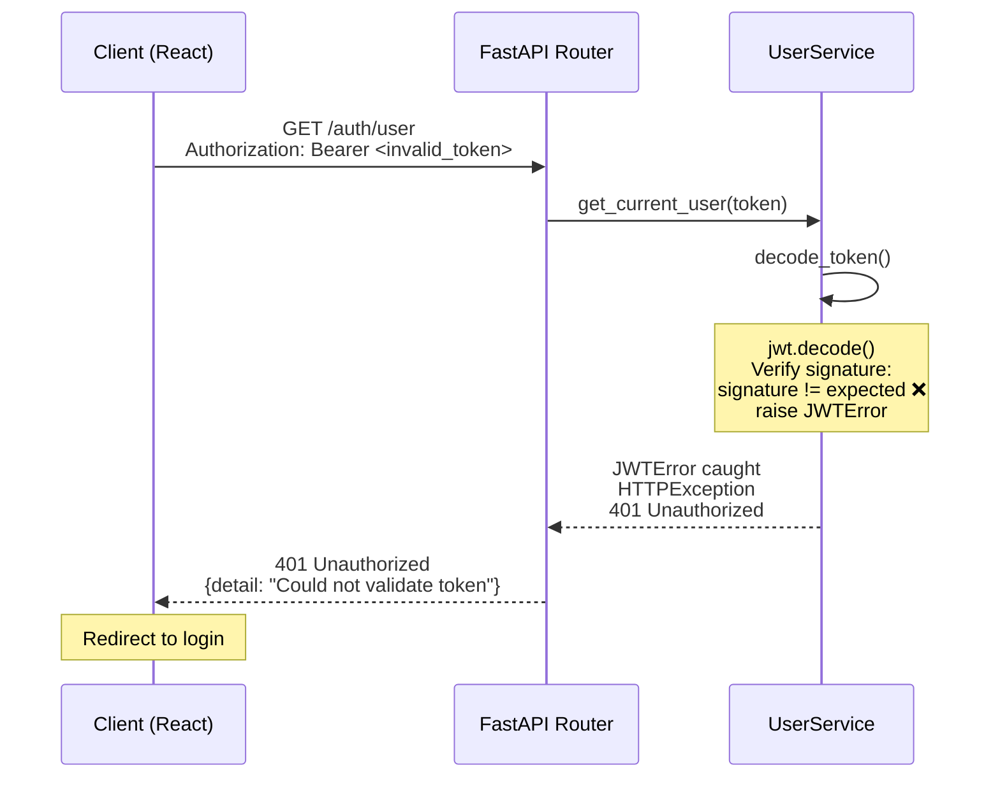

---

## 8. Complete Admin Dashboard Access Flow

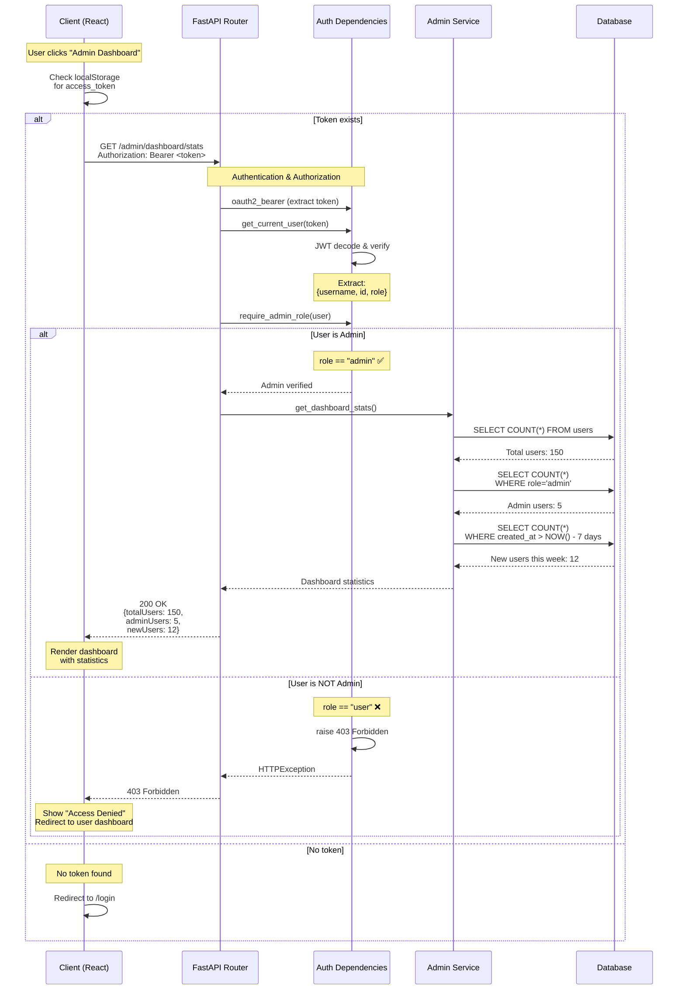

---

## 9. Frontend Authentication Context Flow

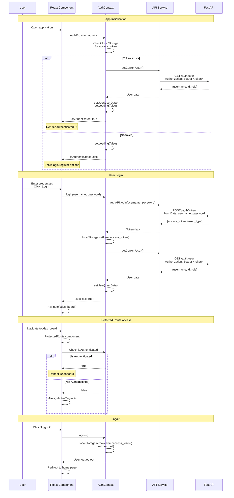

---

## 10. API Interceptor Flow (Automatic Token Handling)

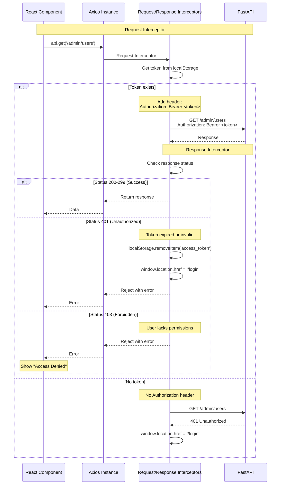

---

## How to View These Diagrams

### Option 1: GitHub
1. Push this file to GitHub
2. GitHub automatically renders Mermaid diagrams

### Option 2: VS Code
1. Install "Markdown Preview Mermaid Support" extension
2. Open this file in VS Code
3. Press `Ctrl+Shift+V` (Preview Markdown)

### Option 3: Online Editor
1. Go to https://mermaid.live/
2. Copy and paste any diagram code
3. Edit and export as PNG/SVG

### Option 4: Documentation Tools
- GitLab (built-in support)
- Notion (with Mermaid blocks)
- Confluence (with Mermaid plugin)
- Docusaurus (built-in support)

---

## JWT Token Structure

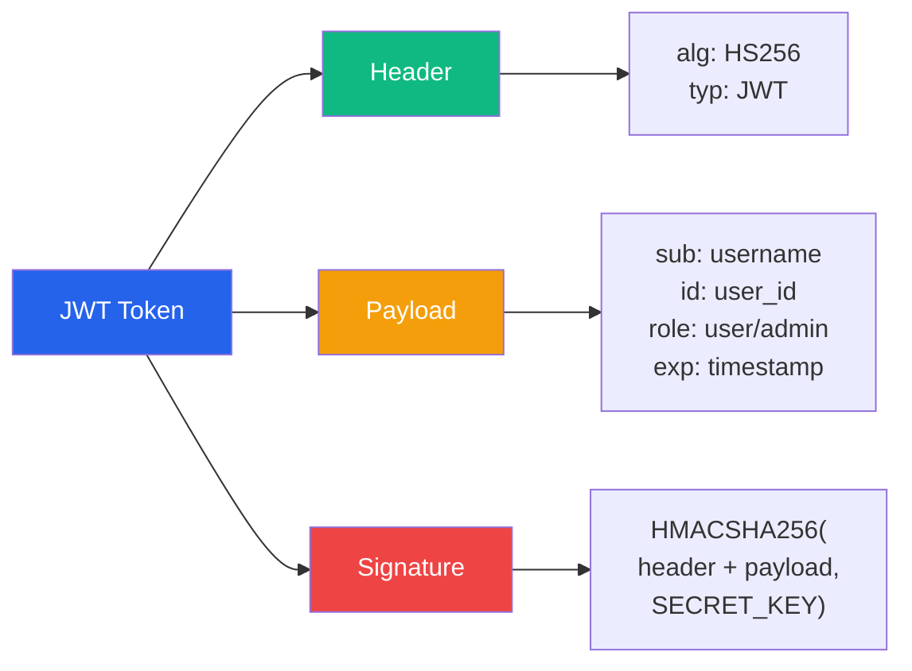

---

## Authentication State Machine

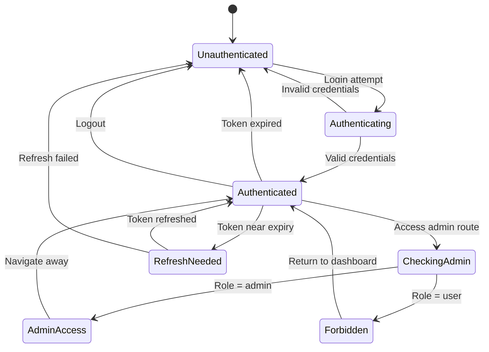

---

## Security Layers

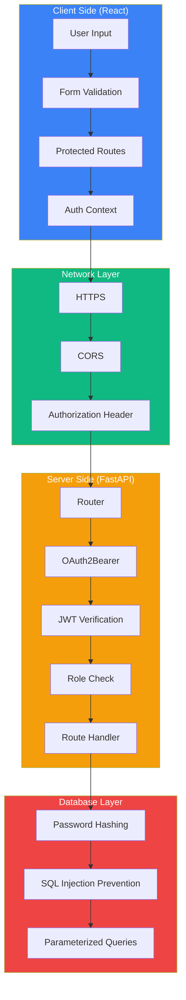

---

## Complete Request Flow (All Layers)

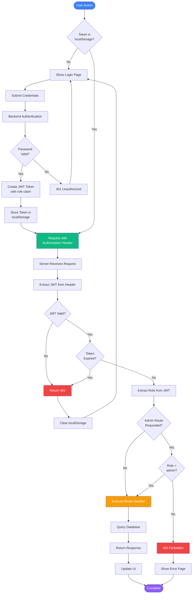

---

## Implementation Reference

| Component | File | Responsibility |
|-----------|------|----------------|
| User Model | `backend/src/auth/models.py` | Database schema with role enum |
| Auth Service | `backend/src/auth/service.py` | JWT creation, validation, user auth |
| Dependencies | `backend/src/auth/dependencies.py` | Admin role checking |
| Router | `backend/src/auth/router.py` | API endpoints |
| Frontend API | `frontend/src/services/api.js` | Axios with interceptors |
| Auth Context | `frontend/src/contexts/AuthContext.jsx` | Global auth state |
| Protected Route | `frontend/src/components/ProtectedRoute.jsx` | Route guarding |

---

This documentation provides complete visual representations of your authentication system!